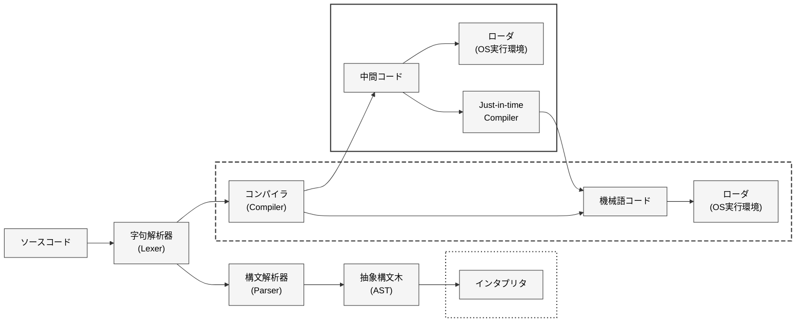

プログラミング言語は以下の四つに大別される

- 即時実行型スクリプト
  - ソースコードを中間的な処理を一切せずに直接実行していく
  - シェルスクリプトやバッチファイルなどが該当
  - 一般的には実行性能はそこまで
- AST評価型スクリプト
  - AST == Abstract Syntax Tree
  - ほとんど実在はしない
    - Rubyの古いバージョンではこの設計になっていたが、実行性能が問題となってきてしまう
- 中間コードコンパイル言語
  - 独自の中間コードにコンパイルされ、動かすための専用のVM上で実行される
  - C#,Java,Python等が該当
- ネイティブコンパイル言語
  - 実際に実行しているコンピューターが直接実行する言語にコンパイルする言語
  - パフォーマンスが高い
  - コンパイルした結果の実行形式hあ、ターゲット以外のアーキテクチャでは動作しない
    - LLVM IRという中間表現んをターゲットとしたコンパイラを作ることで、LLVMが様々なターゲトに際コンパイルしてくれる。gccもこの設計
- その他
  - コマンドラインでインタラクティブに操作できるREPL(Read,Evaluate,Print,Loop)設計
  - マルチターゲット言語

- **チューリング完全**
  - 「万能チューリングマシンと同等の計算能力を持つこと」
  - チューリング完全な言語は、他のあらゆるチューリング完全と同等の能力を持つ
    - TODO: パフォーマンスではない...よね
  - pdf, htmlはチューリング完全ではない
  - チューリング完全はマルウェアが仕込まれる可能性がある。(TODO: チューリング完全でないものはそうでないの？)
- **停止性問題**
  - 「チューリング完全なプログラムが有限な時間内に計算を終えることを、他のアルゴリズムで証明することはできない」
  - プログラムが無限ループになるかそうでないかは実行するまでわからない
- JavaScriptは動的型付け言語だけど、(最も使われているスクリプト言語なので)投資がめっちゃされていてオプティマイザが優秀なので、単純なアルゴリズムならネイティブコンパイル言語に比肩するらしいA
- オブジェクト指向
  - 現在のオブジェクト指向はBjane StroustrapがSimulaという言語からちゃん走を得てC++絵実装しJavaにひろまった概念
    - こちらを「クラスベースのオブジェクト指向」とよんだりする
  - もとはAlan KayによってSmalltalkという言語において提唱されたもので、両者はかなり異なっている
- 関数型言語
  - TODO: ?
- セルフホスティング
  - 自分自身をコンパイルできるか
    - ほとんどのネイティブコンパイル言語が該当(C, C++, Rust)
    - PythonはC, JavascriptはC++で書かれた処理系を使う
  - TODO: あんまり原理がわからん

## コンパイルパイプライン



### 字句解析

- lexer, tokenizerとも  
- 例えば`123+456`を`123`,`+`,`456`に分割すること  
- 後の**構文解析**とまとめて一つの処理となることもある  
- コンバいる時間の最適化のために行われる
  - あらがじめ字句解析しておくことで、構文解析を効率的に行うことができる
- 綺麗に分割するのは難しく、例えばC++のテンプレート引数の<>とシフト演算子の>>が重なってしまう問題があり、`A<B<C> >`のように空白を入れる必要がある時期があった

### 構文解析→AST

- AST==Abstract Syntax Tree
- 構文解析をした結果がASTとして出力される
- 以下のように文字列を木構造に組み直したデータ構造(下はa+b+cの例)

```txt
      +
     / \
    +   c
   / \
  a   b
```

- TODO: 実際保持される時はどんな形式？まさかASCIIアートじゃないだろうし
- 必須の処理ではないが、コンパイラの設計上扱いやすいデータ構造であるため利用されることが多い
- ただし、木構造は通常ヒープメモリを多用し、ポインタでのランダムアクセスも多いため、現代のCPUにとって最適なデータ構造ではない
  - TODO: 記述全体を理解していない
  - バイトコードなどの直接化されたデータの方がCPUのキャッシュが聞きやすく、パフォーマンスが向上する傾向にある

### AST->中間コード

- 言語ごとに大きく異なる
- 静的型付けの場合は方に応じた命令やメモリレイアウトの選択等が行われる

### Just in Time コンパイル

- JITコンパイル<->AoTコンパイル(Ahead of Time)
  - AoTは事前にコンパイルする(普通のコンパイル型言語)
- 実行する段階になってから機械語や低レベルコードにコンパイルする手法
  - そのため、実行のスタートアップ時間にオーバーヘッドがある
  - Javascript,LuaJIT等

