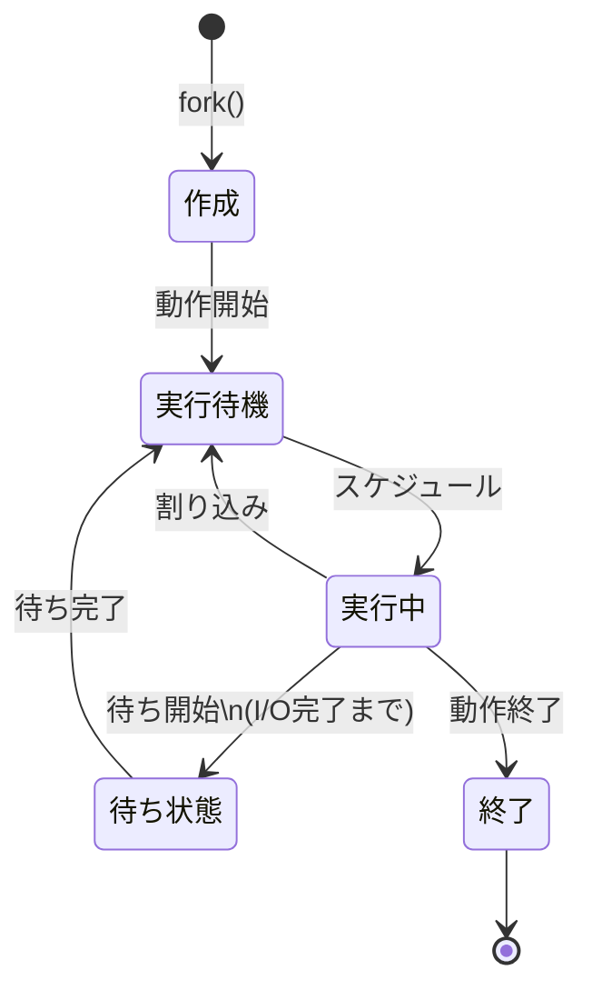
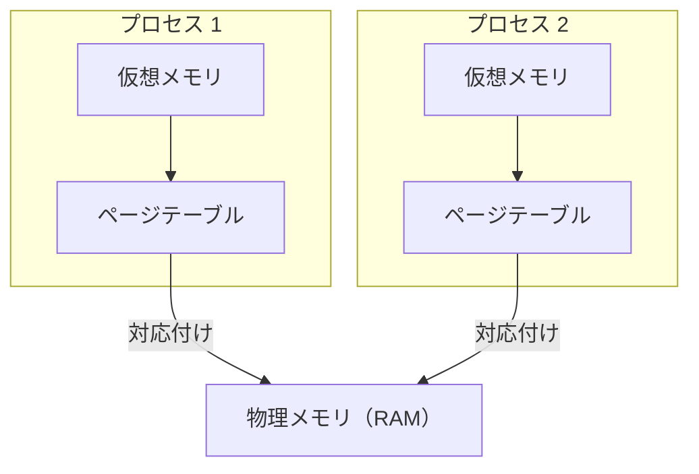

# Linux kernel

## はじめに

OSの主な機能は「様々なHWを抽象化してAPIを提供すること」。プログラムなどはこのAPIを利用している  
Kernelは全てのコア機能を提供するが、それ自体はOSではなくあくまで中心部分にすぎない  

## Linux Architecture

- ハードウェア
  - CPU
  - メインメモリ
  - ディスクドライブ
  - ネットワークインターフェース
  - キーボード
  - モニター
- カーネル
- ユーザ空間
  - shellなどのOSコンポーネント
  - ps,sshなどのユーティリティ
  - X Window SystemなどのGUI
  - などを含む多くのアプリケーションが動作している"場所"

ハートウェアとカーネルの間のIFはHWごとに異なり、種類ごとにグループ化されている
以下、カーネルとユーザ空間に焦点を当てた説明

カーネルとユーザ空間の間のインターフェースがsystem call  
つまり(?)shellや`grep`等のユーティリティはカーネルの一部ではなくユーザ空間で動いているもの  

ユーザモードとカーネルモードの違い  
カーネルモードにおいてはHWに特権的にアクセスできる。ユーザモードからはデバイスファイルなどを介した限定的なアクセス(プログラムからは確かにそんな感じ)  
カーネルモードはHWに直接アクセスできるため抽象化が薄く高速(もちろんバグるとまずい)、ユーザモードはsystem callを介する必要があるため低速だが、安全で便利

## CPU Architecture

BIOSからHWの情報を取得する

```sh
sudo dmidecode
# dmidecode 3.6
Getting SMBIOS data from sysfs.
SMBIOS 3.3.0 present.
Table at 0x89D19000.

Handle 0x0000, DMI type 0, 26 bytes
BIOS Information
        Vendor: American Megatrends International, LLC.
        Version: 1.L8
        Release Date: 06/23/2021
        Address: 0xF0000
        Runtime Size: 64 kB
        ROM Size: 32 MB
        Characteristics:
                PCI is supported
                BIOS is upgradeable
...

Handle 0x008C, DMI type 14, 8 bytes
Group Associations
        Name: $MEI
        Items: 1
                0x0000 (OEM-specific)

Handle 0x008D, DMI type 219, 106 bytes
OEM-specific Type
        Header and Data:
                DB 6A 8D 00 01 04 01 55 02 00 90 06 01 85 39 20
                00 00 00 00 40 00 00 00 00 00 00 00 00 00 00 02
                FF FF FF FF FF FF FF FF FF FF FF FF FF FF FF FF
                FF FF FF FF FF FF FF FF 03 00 00 00 80 00 00 00
                00 00 00 00 00 00 00 00 00 00 00 00 00 00 00 00
                00 04 00 00 00 00 00 00 00 00 00 00 00 00 00 00
                00 00 00 00 00 00 00 00 00 00
        Strings:
                MEI1
                MEI2
                MEI3
                MEI4

Handle 0x008E, DMI type 136, 6 bytes
OEM-specific Type
        Header and Data:
                88 06 8E 00 00 00

Handle 0x008F, DMI type 14, 23 bytes
Group Associations
        Name: Firmware Version Info
        Items: 6
                0x0049 (OEM-specific)
                0x004A (OEM-specific)
                0x004B (OEM-specific)
                0x004C (OEM-specific)
                0x004D (OEM-specific)
                0x005E (OEM-specific)

Handle 0x0090, DMI type 127, 4 bytes
End Of Table


lscpu
アーキテクチャ:                        x86_64
  CPU 操作モード:                      32-bit, 64-bit
  アドレスサイズ:                      39 bits physical, 48 bits virtual
  バイト順序:                          Little Endian
CPU:                                   16
  オンラインになっている CPU のリスト: 0-15
ベンダー ID:                           GenuineIntel
  モデル名:                            11th Gen Intel(R) Core(TM) i7-11700 @ 2.50GHz
    CPU ファミリー:                    6
    モデル:                            167
    コアあたりのスレッド数:            2
    ソケットあたりのコア数:            8
    ソケット数:                        1
    ステッピング:                      1
    CPU スケーリング MHz:              17%
    CPU 最大 MHz:                      4900.0000
    CPU 最小 MHz:                      800.0000
...
```

CPU Architectureは主に以下の種類がある([各kernelのdoc](https://docs.kernel.org/index.html)も参照)

- x86(AMD64)
  - もともとはIntelが開発した命令セットファミリで、後にAMDにライセンス供与された
  - x86はIntel32-bit, x64,x86_64,amd64は64-bitプロセッサを指す
    - x86_64はIntelが開発、amd64はAMDが開発したもので、アーキテクチャとしては同じ
  - x86はアウトオブオーダ実行に依存しており、[Meltdown](https://ja.wikipedia.org/wiki/Meltdown)という脆弱性を持っている...らしい
  - [x86-specific kernel documentation]()
- ARM
  - RISC(Reduced Instruction Set Computing) Architectureの一種。RISC自体は、多くの汎用CPUレジスタとより高速に実行できる小さな命令セットで構成されている
  - 消費電力が少なく、携帯機器や組み込み用のコンピュータ(raspiとか)に搭載される
  - そして高速で安価、x86チップよりも発熱が少ない
  - [Specter](https://ja.wikipedia.org/wiki/Spectre)のような脆弱性を持っている
- RISC-V

## Kernel Component

Linux Kernelはモノリシック==単一のバイナリに全てのcomponentが含まれているが、コードベースでは機能領域がある  
主に以下のcomponentにわけられる

- プロセス管理
  - 実行ファイルに基づくプロセスの管理
- メモリ管理
  - プロセスのメモリ割り当て
  - ファイルをメモリにマップ
- ネットワーク
  - ネットワークインターフェースの管理
  - ネットワークスタックの提供
- ファイルシステム
  - ファイル管理、作成、削除等
- デバイスドライバ
  - デバイスの管理

### プロセス管理

TODO: プロセス関連のコマンドとsyscallもまとめる

カーネルはプロセスを管理するための機能を多くもつ
例を挙げると

- 割り込み
  - CPUアーキテクチャごとに固有
  - 割り込み自体はプロセス管理固有の話ではない
- プログラムの起動
- スケジューリング
- 等々
- プロセスは実行プログラム(バイナリ)に対応する  
  - 正確には同じバイナリから複数プロセスは生まれうる
- スレッドはプロセス内のコードを実行する単位
  - TODO: 理解できていない

プロセス管理において、Linuxには以下のような概念がある


#### タスク

カーネルにとってのスケジューリングの最小単位。  
[shced.h](https://github.com/torvalds/linux/blob/master/include/linux/sched.h)で定義された**task_struct**という構造があり、以下のような情報を保持している

- スケジューリング関連の情報
- PIDなどの識別子
- シグナルハンドラ
- パフォーマンス
- セキュリティ関連の情報
- など

プロセスもスレッドもカーネル視点では`task_struct`で管理されており、持っている`pid`,`tgid`によって区別している

- `pid`
  - スレッドごとに一意
- `tgid`
  - 同じプロセスに属するスレッド群で共通(thread group id)

つまり、system callの`getpid()`では`tgid`が、`gettid()`では`pid`が帰ってくる...(TODO: ソース欲しいかも)

#### スレッド

"タスク"項で示した通り各タスクには`pid`が一意に割り振られるので、タスク≒スレッドで良さそう
カーネル視点では、他のプロセスと特定のリソース↓を共有するプロセス

- メモリ
- シグナルハンドラ
  - <C-c>とか。詳しくはそのうち...
- など

#### プロセス

プログラムの実行に必要なリソースをグループ化したもの。PIDで識別

- スレッド
- アドレス空間
- ソケット
- などなど

カーネルにより、現在のプロセス情報は`/proc/self`にて提供される
複数のプロセスをグループ化した物をプロセスグループ(PGID), プロセスグループをグループ化したものをセッション(SID)という

#### それぞれ説明

```sh
ps -j

    PID    PGID     SID TTY          TIME CMD
  57464   57464   57464 pts/1    00:00:00 bash
  57617   57617   57464 pts/1    00:00:00 ps
```

```sh
ps --help all | grep "j"
 -j                   jobs format
```

bashプロセス、psプロセスそれぞれのPID,PGID,SIDが表示される  
上記の場合、それぞれは同一セッションだが別プロセス(プロセスグループ)といえる  
`/proc/57464/task/57464/`などをみるとタスクの情報を得ることができる

タスクのデータ構造(TODO: さっき言ってたschedの話？)にはスケジューリングに関する情報が含まれており、ある時点でプロセスは下図のいずれかの状態にある



状態遷移はさまザナイベントによって引き起こされる。例えば、実行中のプロセスがI/O操作(ファイルからの読み込みなど)を行い、(CPUを使って)実行を続行できない場合に街状態に遷移することがある

## メモリ管理

- **仮想メモリ**: システムに搭載されている物理メモリサイズ以上のメモリを持っているように見せる(TODO: 誰に？)  
  - 64bit Linuxでは、1プロセスあたり最大128TBの仮想アドレス空間、合計で約64TBの物理メモリの使用が可能(TODO: 合計？)
- 物理メモリと仮想メモリは、ともに**ページ**と呼ばれる固定長(4KB)のチャンクに分割されている(TODO: ページングとかの話かな)
  - Linux2.6.3以降は**Hugepage**がサポートされていて、数MBの大きさにもできる
- 各プロセスは、仮想ページをメインメモリ(RAM)の物理ページにマッピングするための独自のページテーブルを持っている  



複数の仮想ページが各プロセスのページテーブルを介して、同じ物理ページを指すこともできる。これにより、各プロセスにはそのページが実際にRAM上に存在するかのようにふるまいながら、有限であるメモリ空間を効率よく利用する(overcommitという仕組みにより、物理メモリサイズ以上のメモリ確保はできる。物理メモリに対しての割り当ては、実際に使用するまで遅延させている(`/proc/sys/vm/overcommit_memory`で設定ができる))

```sh
cat /proc/sys/vm/overcommit_memory 
0
```

(TODO: 0じゃない時はいつ...?)

- プロセスが仮想ページにアクセスするたび、CPUはその仮想アドレスを、対応する物理アドレスへと変換しなければならない
  - プロセスが仮想ページにアクセス==メモリ内にある何かしらを撮りに行こうとしている
- その処理の高速化のため、TLB(Translation Lookaside Buffer)というチップ上の検索(TODO:チップ上?)をサポートしている(キャッシュのような物)
  - `lscpu -C`でキャッシュの量を確認できる

```sh
lscpu -C
NAME ONE-SIZE ALL-SIZE WAYS TYPE        LEVEL  SETS PHY-LINE COHERENCY-SIZE
L1d       48K     384K   12 Data            1    64        1             64
L1i       32K     256K    8 Instruction     1    64        1             64
L2       512K       4M    8 Unified         2  1024        1             64
L3        16M      16M   16 Unified         3 16384        1             64
```


- `/proc/meminfo`より、メモリ関連の情報を確認できる

```sh
# 物理メモリの合計サイズ
grep MemTotal /proc/meminfo
MemTotal:        3461932 kB

# 仮想メモリの合計サイズ
grep VmallocTotal /proc/meminfo
VmallocTotal:   135288315904 kB

# Hugepage情報
grep Huge /proc/meminfo
AnonHugePages:    516096 kB
ShmemHugePages:        0 kB
FileHugePages:     22528 kB
HugePages_Total:       0
HugePages_Free:        0
HugePages_Rsvd:        0
HugePages_Surp:        0
Hugepagesize:       2048 kB
Hugetlb:               0 kB
```

(TODO: Hugepage情報の各項目)
(TODO: `grep ~~~ /proc/meminfo`の記法初めてみたけど何？)

## ネットワーク管理

カーネルの役割は以下の三つ

- ソケット
  - 通信を抽象化するためのもの(TODO:?)
- TCP/UDP
  - データ転送を担う
- IP
  - アドレスに基づいたマシン間の通信を担う
- HTTPやSSHなどのアプリケーション層のプロトコルはユーザ空間で実装される

詳しくはまた後ほど

## ファイルシステム

ファイルシステムにはいくつか種類がある

- ext4
- btrfs
- NTFS

(TODO: 何が違う？)  

- **VFS(Virtual File System)**
  - 異なるファイルシステムが共存できるように導入された
  - 上位層(ユーザ空間に近い側)
    - `open`,`close`,`read`,`write`等の共有APIで抽象化
  - 下位層
    - 与えられたファイルシステムに対して、抽象化のためのプラグインを提供する

詳しくは後ほど

## デバイスドライバ

カーネルで動作する小規模なコード。種々のハードウェアや`/dev/pts/`下の擬似端末のようなデバイスを制御する  
(TODO: `/dev/pts`しらない)  
デバイスドライバとカーネルコンポーネントの相関図↓


```sh
# Linuxシステム上のデバイスを確認
ls -al /sys/devices
total 0
drwxr-xr-x 15 root root 0 Jun 22 07:49 .
dr-xr-xr-x 13 root root 0 Jun 22 07:49 ..
drwxr-xr-x  5 root root 0 Jun 22 07:49 LNXSYSTM:00
drwxr-xr-x  3 root root 0 Jun 22 07:49 breakpoint
...
drwxr-xr-x  4 root root 0 Jun 22 07:49 uprobe
drwxr-xr-x 20 root root 0 Jun 22 07:49 virtual

# マウントされているデバイス一覧
mount
tmpfs on /run type tmpfs (rw,nosuid,nodev,size=692388k,nr_inodes=819200,mode=755,inode64)
/dev/vda2 on / type ext4 (rw,relatime)
devtmpfs on /dev type devtmpfs (rw,nosuid,size=900928k,nr_inodes=225232,mode=755,inode64)
tmpfs on /dev/shm type tmpfs (rw,nosuid,nodev,inode64,usrquota)
devpts on /dev/pts type devpts (rw,nosuid,noexec,relatime,gid=5,mode=600,ptmxmode=000)
sysfs on /sys type sysfs (rw,nosuid,nodev,noexec,relatime)
...
none on /run/credentials/serial-getty@ttyAMA0.service type tmpfs (ro,nosuid,nodev,noexec,relatime,nosymfollow,size=1024k,nr_inodes=1024,mode=700,inode64,noswap)
tmpfs on /run/user/1000 type tmpfs (rw,nosuid,nodev,relatime,size=346192k,nr_inodes=86548,mode=700,uid=1000,gid=1000,inode64)
portal on /run/user/1000/doc type fuse.portal (rw,nosuid,nodev,relatime,user_id=1000,group_id=1000)
nsfs on /run/snapd/ns/prompting-client.mnt type nsfs (rw)
```

---

ここまででLinuxカーネルのコンポーネントは網羅

---

## システムコール

- CPUには特権レベル(カーネルモード、スーパーバイザモード)があり、ユーザ空間のプログラムは特権命令(HWへの直接の命令、ページテーブル変更など)を実行できない。ので、カーネルにそれを任せる必要があり、その仕組みをsyscallという
- 例えばterminalで`touch test`とした場合、最終的にはsys callが呼ばれる
- system callの呼び出しは以下のような工程に分けられる
  - カーネルは`syscall.h`とアーキテクチャ依存を示すファイルで定義された、`sys_call_table`変数で定義されているメモリ上の関数ポインタの配列。system callとhandlerが登録されている
  - `system_call()`によって、HWコンテキスト(TODO:??)をスタックに保存し、チェック(トレースが行われているかどうか)(TODO:??)をして、`sys_call_table`内のsystem call番号のindexが指すhandlerへジャンプする
  - `sysexit`によってsystem callが終了すると、ラッパーライブラリ(TODO:??)はHWコンテキストを復元し、プログラムの実行はユーザ空間で再開される
- カーメルモードとユーザ空間モードの切り替えは時間のかかる処理
- `strace`によって、system callの呼ばれ方？を可視化できる。`-c`で時間等を計測できる

```sh
nas@nas-Z590-S01:~/work/book-study/learning-modern-linux$ strace ls
# syscall`execve`は、`/usr/bin/ls`を実行し、シェルプロセスと入れ替えられる
execve("/usr/bin/ls", ["ls"], 0x7fffba2f89d0 /* 37 vars */) = 0
# syscall`brk`はメモリの割り当て。例えばC言語の`malloc`は、確保するメモリの量に応じて`brk`か`mmap`syscallを呼ぶ
...
brk(NULL)                               = 0x653841a67000
# `access`sys callは、processが特定のfileに対してアクセス許可があるかを確認する
access("/etc/ld.so.preload", R_OK)      = -1 ENOENT (そのようなファイルやディレクトリはありません)
# `openat`は第二引数のファイルを第一引数のディレクトリファイルディスクリプタと第三引数のフラグでopenする
openat(AT_FDCWD, "/etc/ld.so.cache", O_RDONLY|O_CLOEXEC) = 3
...
# `read`は第一引数のファイルディスクリプタから第三引数のbyte分を第二引数(バッファ)に読みとる
read(3, "\177ELF\2\1\1\0\0\0\0\0\0\0\0\0\3\0>\0\1\0\0\0\0\0\0\0\0\0\0\0"..., 832) = 832
```

TODO: ちゃんとそれぞれの引数とかの意味を調べる

https://filippo.io/linux-syscall-table/ に各system callについて書かれているので参照


## (本には書かれていないけど調べてたことのメモ)

### /proc/

Linuxにおいては`/proc/`に各PIDが配置されていて、`/proc/<PID>/status`からそのプロセスの情報をみることができる  
`/proc/`以下には例えば以下のようなものもある

- `/proc/self/exe`はファイルというよりシンボリックリンクで、そのリンク先がプロセス自身の実行ファイルの絶対パス(`ls -l /proc/self/exe`とかでみよう)
- `/proc/<PID>/`以下に各プロセスの情報が並び、`/proc/self/`は「アクセス中のプロセス自身の`/proc/<PID>/`」へのショートカット
  - `/proc/self/cwd`
    - カレントディレクトリへのリンク
  - `/proc/self/cmdline`
    - 起動時のコマンドライン引数（NUL区切り）
    - TODO: ???
  - `/proc/self/fd/`
    - 開いているファイルディスクリプタ一覧
    - `2>&1`とかのやつかな
  - `/proc/self/maps`
    - メモリマップ
    - 以下のような出力。TODO:あんまりわからん
 
```sh
nas@nas-QEMU-Virtual-Machine:~/ws/learning-modern-linux$ cat /proc/self/maps 
b0eadf5b0000-b0eadfe6c000 r-xp 00000000 fd:02 655871                     /usr/lib/cargo/bin/coreutils/cat
b0eadfe7f000-b0eadffd0000 r--p 008bf000 fd:02 655871                     /usr/lib/cargo/bin/coreutils/cat
b0eadffd0000-b0eadffd6000 rw-p 00a10000 fd:02 655871                     /usr/lib/cargo/bin/coreutils/cat
b0eadffd6000-b0eadffd7000 rw-p 00000000 00:00 0 
b0eb0770e000-b0eb07800000 rw-p 00000000 00:00 0                          [heap]
e5517f8f0000-e5517f987000 r-xp 00000000 fd:02 660159                     /usr/lib/aarch64-linux-gnu/libpcre2-8.so.0.14.0
```


