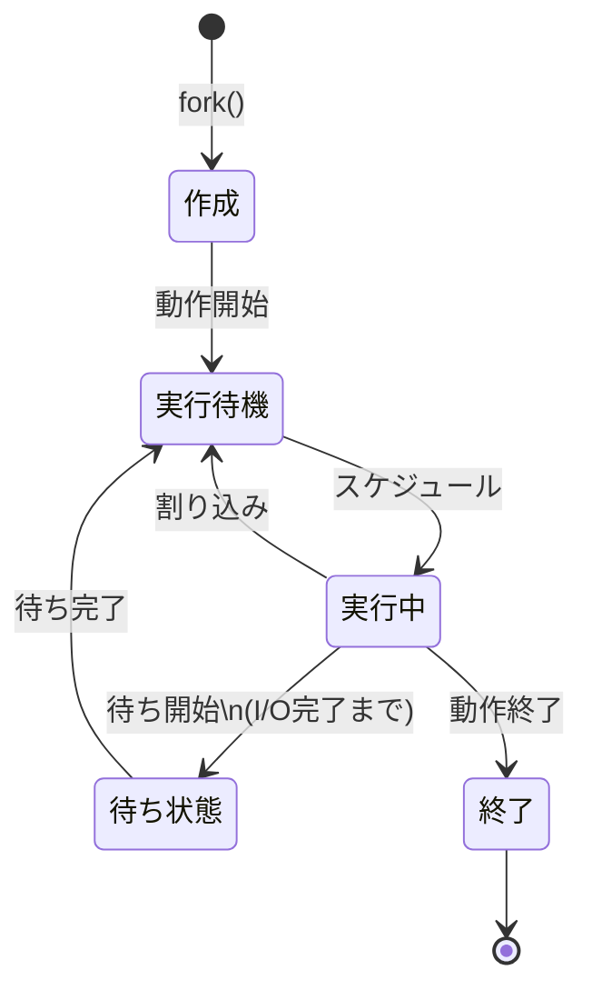
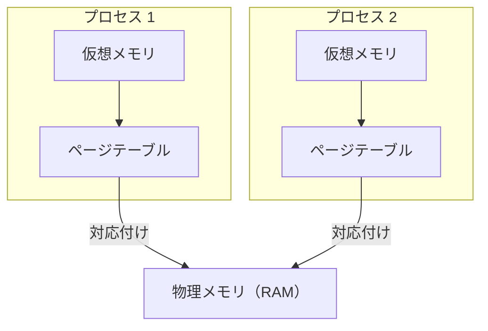

# Linux kernel

## はじめに

OSの主な機能は「様々なHWを抽象化してAPIを提供すること」。プログラムなどはこのAPIを利用している  
Kernelは全てのコア機能を提供するが、それ自体はOSではなくあくまで中心部分にすぎない  

## Linux Architecture

- ハードウェア
  - CPU
  - メインメモリ
  - ディスクドライブ
  - ネットワークインターフェース
  - キーボード
  - モニター
- カーネル
- ユーザ空間
  - shellなどのOSコンポーネント
  - ps,sshなどのユーティリティ
  - X Window SystemなどのGUI
  - などを含む多くのアプリケーションが動作している"場所"

ハートウェアとカーネルの間のIFはHWごとに異なり、種類ごとにグループ化されている
以下、カーネルとユーザ空間に焦点を当てた説明

カーネルとユーザ空間の間のインターフェースがsystem call  
つまり(?)shellや`grep`等のユーティリティはカーネルの一部ではなくユーザ空間で動いているもの  

ユーザモードとカーネルモードの違い  
カーネルモードにおいてはHWに特権的にアクセスできる。ユーザモードからはデバイスファイルなどを介した限定的なアクセス(プログラムからは確かにそんな感じ)  
カーネルモードはHWに直接アクセスできるため抽象化が薄く高速(もちろんバグるとまずい)、ユーザモードはsystem callを介する必要があるため低速だが、安全で便利

## CPU Architecture

BIOSからHWの情報を取得する

```sh
nas@nas-QEMU-Virtual-Machine:~/ws/learning-modern-linux/chap2$ dmidecode >> memo.md 2>&1
# dmidecode 3.6
# No SMBIOS nor DMI entry point found, sorry.
# dmidecode 3.6
/sys/firmware/dmi/tables/smbios_entry_point: Permission denied
# No SMBIOS nor DMI entry point found, sorry.

nas@nas-QEMU-Virtual-Machine:~/ws/learning-modern-linux/chap2$ lscpu >> memo.md 2>&1
Architecture:                            aarch64
CPU op-mode(s):                          64-bit
Byte Order:                              Little Endian
CPU(s):                                  4
On-line CPU(s) list:                     0-3
Vendor ID:                               Apple
Model name:                              -
Model:                                   0
Thread(s) per core:                      1
Core(s) per socket:                      4
Socket(s):                               1
Stepping:                                0x0
BogoMIPS:                                48.00
Flags:                                   fp asimd evtstrm aes pmull sha1 sha2 crc32 atomics fphp asimdhp cpuid asimdrdm jscvt fcma lrcpc dcpop sha3 asimddp sha512 asimdfhm dit uscat ilrcpc flagm sb paca pacg dcpodp flagm2 frint bf16 bti afp
NUMA node(s):                            1
NUMA node0 CPU(s):                       0-3
Vulnerability Gather data sampling:      Not affected
Vulnerability Ghostwrite:                Not affected
Vulnerability Indirect target selection: Not affected
Vulnerability Itlb multihit:             Not affected
Vulnerability L1tf:                      Not affected
Vulnerability Mds:                       Not affected
Vulnerability Meltdown:                  Not affected
Vulnerability Mmio stale data:           Not affected
Vulnerability Old microcode:             Not affected
Vulnerability Reg file data sampling:    Not affected
Vulnerability Retbleed:                  Not affected
Vulnerability Spec rstack overflow:      Not affected
Vulnerability Spec store bypass:         Vulnerable
Vulnerability Spectre v1:                Mitigation; __user pointer sanitization
Vulnerability Spectre v2:                Mitigation; CSV2, but not BHB
Vulnerability Srbds:                     Not affected
Vulnerability Tsa:                       Not affected
Vulnerability Tsx async abort:           Not affected
Vulnerability Vmscape:                   Not affected
```

このCPUはaarch64==arm64  
(VM上だからmodel nameは書いてないのかな？)

CPU Architectureは主に以下の種類がある([各kernelのdoc](https://docs.kernel.org/index.html)も参照)

- x86(AMD64)
  - もともとはIntelが開発した命令セットファミリで、後にAMDにライセンス供与された
  - x86はIntel32-bit, x64,x86_64,amd64は64-bitプロセッサを指す
    - x86_64はIntelが開発、amd64はAMDが開発したもので、アーキテクチャとしては同じ
  - x86はアウトオブオーダ実行に依存しており、[Meltdown](https://ja.wikipedia.org/wiki/Meltdown)という脆弱性を持っている...らしい
  - [x86-specific kernel documentation]()
- ARM
  - RISC(Reduced Instruction Set Computing) Architectureの一種。RISC自体は、多くの汎用CPUレジスタとより高速に実行できる小さな命令セットで構成されている
  - 消費電力が少なく、携帯機器や組み込み用のコンピュータ(raspiとか)に搭載される
  - そして高速で安価、x86チップよりも発熱が少ない
  - [Specter](https://ja.wikipedia.org/wiki/Spectre)のような脆弱性を持っている
- RISC-V

## Kernel Component

Linux Kernelはモノリシック==単一のバイナリに全てのcomponentが含まれているが、コードベースでは機能領域がある  
主に以下のcomponentにわけられる

- プロセス管理
  - 実行ファイルに基づくプロセスの管理
- メモリ管理
  - プロセスのメモリ割り当て
  - ファイルをメモリにマップ
- ネットワーク
  - ネットワークインターフェースの管理
  - ネットワークスタックの提供
- ファイルシステム
  - ファイル管理、作成、削除等
- デバイスドライバ
  - デバイスの管理

### プロセス管理

TODO: プロセス関連のコマンドとsyscallもまとめる

カーネルはプロセスを管理するための機能を多くもつ
例を挙げると

- 割り込み
  - CPUアーキテクチャごとに固有
  - 割り込み自体はプロセス管理固有の話ではない
- プログラムの起動
- スケジューリング
- 等々
- プロセスは実行プログラム(バイナリ)に対応する  
  - 正確には同じバイナリから複数プロセスは生まれうる
- スレッドはプロセス内のコードを実行する単位
  - TODO: 理解できていない

プロセス管理において、Linuxには以下のような概念がある


#### タスク

カーネルにとってのスケジューリングの最小単位。  
[shced.h](https://github.com/torvalds/linux/blob/master/include/linux/sched.h)で定義された**task_struct**という構造があり、以下のような情報を保持している

- スケジューリング関連の情報
- PIDなどの識別子
- シグナルハンドラ
- パフォーマンス
- セキュリティ関連の情報
- など

プロセスもスレッドもカーネル視点では`task_struct`で管理されており、持っている`pid`,`tgid`によって区別している

- `pid`
  - スレッドごとに一意
- `tgid`
  - 同じプロセスに属するスレッド群で共通(thread group id)

つまり、system callの`getpid()`では`tgid`が、`gettid()`では`pid`が帰ってくる...(TODO: ソース欲しいかも)

#### スレッド

"タスク"項で示した通り各タスクには`pid`が一意に割り振られるので、タスク≒スレッドで良さそう
カーネル視点では、他のプロセスと特定のリソース↓を共有するプロセス

- メモリ
- シグナルハンドラ
  - <C-c>とか。詳しくはそのうち...
- など

#### プロセス

プログラムの実行に必要なリソースをグループ化したもの。PIDで識別

- スレッド
- アドレス空間
- ソケット
- などなど

カーネルにより、現在のプロセス情報は`/proc/self`にて提供される
複数のプロセスをグループ化した物をプロセスグループ(PGID), プロセスグループをグループ化したものをセッション(SID)という

#### それぞれ説明

```sh
ps -j

    PID    PGID     SID TTY          TIME CMD
  57464   57464   57464 pts/1    00:00:00 bash
  57617   57617   57464 pts/1    00:00:00 ps
```

```sh
ps --help all | grep "j"
 -j                   jobs format
```

bashプロセス、psプロセスそれぞれのPID,PGID,SIDが表示される  
上記の場合、それぞれは同一セッションだが別プロセス(プロセスグループ)といえる  
`/proc/57464/task/57464/`などをみるとタスクの情報を得ることができる

タスクのデータ構造(TODO: さっき言ってたschedの話？)にはスケジューリングに関する情報が含まれており、ある時点でプロセスは下図のいずれかの状態にある



状態遷移はさまザナイベントによって引き起こされる。例えば、実行中のプロセスがI/O操作(ファイルからの読み込みなど)を行い、(CPUを使って)実行を続行できない場合に街状態に遷移することがある

## メモリ管理

- **仮想メモリ**: システムに搭載されている物理メモリサイズ以上のメモリを持っているように見せる(TODO: 誰に？)  
  - 64bit Linuxでは、1プロセスあたり最大128TBの仮想アドレス空間、合計で約64TBの物理メモリの使用が可能(TODO: 合計？)
- 物理メモリと仮想メモリは、ともに**ページ**と呼ばれる固定長(4KB)のチャンクに分割されている(TODO: ページングとかの話かな)
  - Linux2.6.3以降は**Hugepage**がサポートされていて、数MBの大きさにもできる
- 各プロセスは、仮想ページをメインメモリ(RAM)の物理ページにマッピングするための独自のページテーブルを持っている  



複数の仮想ページが各プロセスのページテーブルを介して、同じ物理ページを指すこともできる。これにより、各プロセスにはそのページが実際にRAM上に存在するかのようにふるまいながら、有限であるメモリ空間を効率よく利用する(overcommitという仕組みにより、物理メモリサイズ以上のメモリ確保はできる。物理メモリに対しての割り当ては、実際に使用するまで遅延させている(`/proc/sys/vm/overcommit_memory`で設定ができる))

```sh
cat /proc/sys/vm/overcommit_memory 
0
```

(TODO: 0じゃない時はいつ...?)

- プロセスが仮想ページにアクセスするたび、CPUはその仮想アドレスを、対応する物理アドレスへと変換しなければならない
  - プロセスが仮想ページにアクセス==メモリ内にある何かしらを撮りに行こうとしている
- その処理の高速化のため、TLB(Translation Lookaside Buffer)というチップ上の検索(TODO:チップ上?)をサポートしている(キャッシュのような物)
  - `lscpu -C`でキャッシュの量を確認できる

```sh
lscpu -C
NAME ONE-SIZE ALL-SIZE WAYS TYPE        LEVEL SETS PHY-LINE COHERENCY-SIZE
L1d                         Data            1               
L1i                         Instruction     1               
L2                          Unified         2   
```

(TODO: VM上だから何も出なかったのかな...)

- `/proc/meminfo`より、メモリ関連の情報を確認できる

```sh
# 物理メモリの合計サイズ
grep MemTotal /proc/meminfo
MemTotal:        3461932 kB

# 仮想メモリの合計サイズ
grep VmallocTotal /proc/meminfo
VmallocTotal:   135288315904 kB

# Hugepage情報
grep Huge /proc/meminfo
AnonHugePages:    516096 kB
ShmemHugePages:        0 kB
FileHugePages:     22528 kB
HugePages_Total:       0
HugePages_Free:        0
HugePages_Rsvd:        0
HugePages_Surp:        0
Hugepagesize:       2048 kB
Hugetlb:               0 kB
```

(TODO: Hugepage情報の各項目)
(TODO: `grep ~~~ /proc/meminfo`の記法初めてみたけど何？)

## ネットワーク管理

カーネルの役割は以下の三つ

- ソケット
  - 通信を抽象化するためのもの(TODO:?)
- TCP/UDP
  - データ転送を担う
- IP
  - アドレスに基づいたマシン間の通信を担う
- HTTPやSSHなどのアプリケーション層のプロトコルはユーザ空間で実装される

詳しくはまた後ほど

## ファイルシステム

ファイルシステムにはいくつか種類がある

- ext4
- btrfs
- NTFS

(TODO: 何が違う？)  

- **VFS(Virtual File System)**
  - 異なるファイルシステムが共存できるように導入された
  - 上位層(ユーザ空間に近い側)
    - `open`,`close`,`read`,`write`等の共有APIで抽象化
  - 下位層
    - 与えられたファイルシステムに対して、抽象化のためのプラグインを提供する

詳しくは後ほど

## デバイスドライバ

カーネルで動作する小規模なコード。種々のハードウェアや`/dev/pts/`下の擬似端末のようなデバイスを制御する  
(TODO: `/dev/pts`しらない)  
デバイスドライバとカーネルコンポーネントの相関図↓


```sh
# Linuxシステム上のデバイスを確認
ls -al /sys/devices
total 0
drwxr-xr-x 15 root root 0 Jun 22 07:49 .
dr-xr-xr-x 13 root root 0 Jun 22 07:49 ..
drwxr-xr-x  5 root root 0 Jun 22 07:49 LNXSYSTM:00
drwxr-xr-x  3 root root 0 Jun 22 07:49 breakpoint
...
drwxr-xr-x  4 root root 0 Jun 22 07:49 uprobe
drwxr-xr-x 20 root root 0 Jun 22 07:49 virtual

# マウントされているデバイス一覧
mount
tmpfs on /run type tmpfs (rw,nosuid,nodev,size=692388k,nr_inodes=819200,mode=755,inode64)
/dev/vda2 on / type ext4 (rw,relatime)
devtmpfs on /dev type devtmpfs (rw,nosuid,size=900928k,nr_inodes=225232,mode=755,inode64)
tmpfs on /dev/shm type tmpfs (rw,nosuid,nodev,inode64,usrquota)
devpts on /dev/pts type devpts (rw,nosuid,noexec,relatime,gid=5,mode=600,ptmxmode=000)
sysfs on /sys type sysfs (rw,nosuid,nodev,noexec,relatime)
...
none on /run/credentials/serial-getty@ttyAMA0.service type tmpfs (ro,nosuid,nodev,noexec,relatime,nosymfollow,size=1024k,nr_inodes=1024,mode=700,inode64,noswap)
tmpfs on /run/user/1000 type tmpfs (rw,nosuid,nodev,relatime,size=346192k,nr_inodes=86548,mode=700,uid=1000,gid=1000,inode64)
portal on /run/user/1000/doc type fuse.portal (rw,nosuid,nodev,relatime,user_id=1000,group_id=1000)
nsfs on /run/snapd/ns/prompting-client.mnt type nsfs (rw)
```

---

ここまででLinuxカーネルのコンポーネントは網羅

---

## システムコール


## (本には書かれていないけど調べてたことのメモ)

### system call

CPUには特権レベルがあり、ユーザ空間のプログラムは特権命令(HWへの直接の命令、ページテーブル変更など)を実行できない。ので、カーネルにそれを任せる必要があり、その仕組みをsyscallという  

### /proc/

Linuxにおいては`/proc/`に各PIDが配置されていて、`/proc/<PID>/status`からそのプロセスの情報をみることができる  
`/proc/`以下には例えば以下のようなものもある

- `/proc/self/exe`はファイルというよりシンボリックリンクで、そのリンク先がプロセス自身の実行ファイルの絶対パス(`ls -l /proc/self/exe`とかでみよう)
- `/proc/<PID>/`以下に各プロセスの情報が並び、`/proc/self/`は「アクセス中のプロセス自身の`/proc/<PID>/`」へのショートカット
  - `/proc/self/cwd`
    - カレントディレクトリへのリンク
  - `/proc/self/cmdline`
    - 起動時のコマンドライン引数（NUL区切り）
    - TODO: ???
  - `/proc/self/fd/`
    - 開いているファイルディスクリプタ一覧
    - `2>&1`とかのやつかな
  - `/proc/self/maps`
    - メモリマップ
    - 以下のような出力。TODO:あんまりわからん
 
```sh
nas@nas-QEMU-Virtual-Machine:~/ws/learning-modern-linux$ cat /proc/self/maps 
b0eadf5b0000-b0eadfe6c000 r-xp 00000000 fd:02 655871                     /usr/lib/cargo/bin/coreutils/cat
b0eadfe7f000-b0eadffd0000 r--p 008bf000 fd:02 655871                     /usr/lib/cargo/bin/coreutils/cat
b0eadffd0000-b0eadffd6000 rw-p 00a10000 fd:02 655871                     /usr/lib/cargo/bin/coreutils/cat
b0eadffd6000-b0eadffd7000 rw-p 00000000 00:00 0 
b0eb0770e000-b0eb07800000 rw-p 00000000 00:00 0                          [heap]
e5517f8f0000-e5517f987000 r-xp 00000000 fd:02 660159                     /usr/lib/aarch64-linux-gnu/libpcre2-8.so.0.14.0
```


